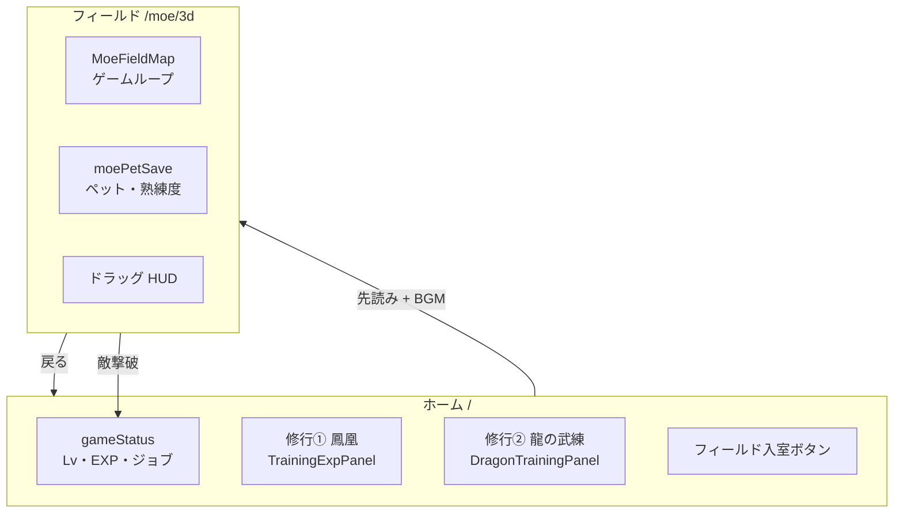
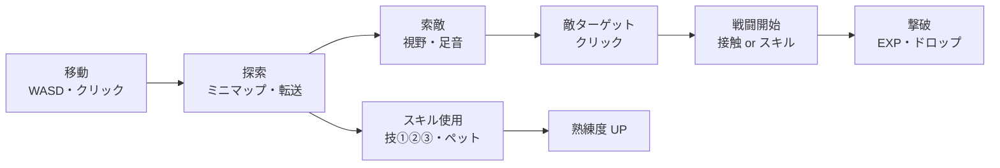

# MOE フィールド — 全体目次（1枚）

**life-rpg-next-3d** を初めて触る人・久しぶりに戻る人向けの早見表。  
ゲームの目的 → プレイの流れ → コードの置き場、の順で読むと迷子になりにくい。

| もっと深く | リンク |
|-----------|--------|
| ファイル単位の索引 | [`moe-files.md`](./moe-files.md) |
| 育成・スキル設計 | [`moe-player-progression.md`](./moe-player-progression.md) |
| ペット愛着度（手動スキル解禁） | [`moe-pet-loyalty.md`](./moe-pet-loyalty.md) |
| 落とし穴・再発防止 | [`moe-lessons.md`](./moe-lessons.md) |

---

## 目次

1. [プロジェクトの目的](#1-プロジェクトの目的)
2. [2つの世界（ホーム ↔ フィールド）](#2-2つの世界ホーム--フィールド)
3. [プレイヤーの流れ](#3-プレイヤーの流れ)
4. [スキルと育成](#4-スキルと育成)
5. [HUD・フローティング UI](#5-hudフローティング-ui)
6. [セーブとデータ](#6-セーブとデータ)
7. [コード構成](#7-コード構成)
8. [サブシステム地図](#8-サブシステム地図)
9. [混同しやすい概念](#9-混同しやすい概念)
10. [マクロ（開発サイクル）](#10-マクロ開発サイクル)
11. [開発のしかた](#11-開発のしかた)
12. [関連ドキュメント](#12-関連ドキュメント)

---

## 1. プロジェクトの目的

MOE（モンスター牧場オンライン）風の **3D フィールド RPG** を、Next.js + Three.js で自作している。

| レイヤー | 何をするか |
|---------|-----------|
| **現実** | 鳳凰修行（整える）・龍の武練（動く）をタイマー＋メモで記録し、習慣をゲーム化する |
| **ゲーム** | ペットとフィールドを歩き、敵と戦い、スキルを覚え、マップを転送し、BGM と HUD で没入する |
| **テーマ** | **鳳凰**＝知恵・整える · **龍神**＝実践・動く · 両方で「人生レベルアップ」 |

> 鳳凰で整えて知恵を上げ、龍神で出して実践力を上げる。

---

## 2. 2つの世界（ホーム ↔ フィールド）



| 世界 | URL | 状態の主な保存先 |
|------|-----|----------------|
| **ホーム** | `/` | `gameStatus`（Lv/EXP）· 鳳凰修行 · 龍の武練 |
| **2D フィールド** | `/moe` | ペット進行 · HUD 位置 · 各種 settings |
| **3D フィールド** | `/moe/3d` | 同上（**メイン開発ターゲット**） |
| **図鑑系** | `/moe/monsters` `/moe/dragons` | 参照 UI |

開発: `npm run dev` → **http://localhost:3001**

---

## 3. プレイヤーの流れ

### ホームでやること

1. **人生レベル** — ボタンで EXP 取得（プロトタイプ）· バックアップセーブ/ロード  
2. **修行① 鳳凰** — タイマー · 内省メモ · スキルゲット進行  
3. **修行② 龍の武練** — タイマー · 行動ログ · 龍 EXP  
4. **フィールド入室** — 先読み（`moeFieldPrefetch`）後 `/moe/3d` へ  

### フィールドでやること



| 操作 | 内容 |
|------|------|
| 移動 | 3D 地形 · コライダー（箱・柱・緑コライダー）· アルター転送 |
| 索敵 | 敵の視野扇形＋足音 · 忍び足/隠れ蓑で回避 |
| 戦闘 | 接触 or 攻撃スキル → デュエル開始 |
| ペット | 命令（もどれ・待て・攻撃）· SOS 脱出 |
| UI | ドラッグ HUD · **クリックで手前**（パネルスタック） |

### 戦闘の流れ（デュエル）

| フェーズ | 何が起きる |
|---------|-----------|
| `approach` | プレイヤー/ペットが敵へ接近 · 交戦タイムバー表示 |
| `simultaneous_charge` | MOE 風タイムバー充填 · 先に満タンの側が行動 |
| 解決 | ダメージ・スキル効果 · バトルログに DQ10 風テキスト |
| 終了 | 撃破 → ホーム EXP 加算 · `endActiveDuel` で 3D ロック解除 |

関連: `MoeDuelTimeBarWindow` · `moeBattleLog.js` · `duelCombatSessionRef`（「もどれ」修正）

---

## 4. スキルと育成

### 育成レール（4層）

| # | レール | 上げ方 | 効くもの |
|---|--------|--------|---------|
| 1 | **訓練士 Lv** | ペット育成 EXP（撃破でホーム EXP も） | HP/MP/スタミナ上限 |
| 2 | **鳳凰スキルゲット ×9** | 修行①（Lv10〜90） | 技②・鳳凰系 |
| 3 | **龍神スキルゲット ×9** | 修行②（Lv10〜90） | 技②・龍系（筋斗雲・スケボー等） |
| 4 | **スキル熟練度** | フィールドで実際に使う | MOE 風成功率（0.1 刻み） |

**覚える**＝修行でゲット · **伸ばす**＝フィールドで使う（別レール）。

### スキル枠（HUD）

| 枠 | 切替名 | 主な内容 | データ |
|----|--------|---------|--------|
| **技①** | `player1` | ライトヒール・テレポ・回復系 | `moePlayerSkillSlotOrder.js` |
| **技②** | `player2` | 鳳凰/龍の修行スキル | `moePhoenix*` / `moeDragon*` |
| **技③** | `player3` | 敵ステサーチ · 生活改鳳 · 自力整龍 | `moePlayerUtilitySkills.js` |
| **ペット** | `pet` | 戦闘スキル・生活改鳳（ペット版）等 | `moePetCombatSkills.js` |

**愛着100でペットスキル手動解禁**（未実装 · 設計は [`moe-pet-loyalty.md`](./moe-pet-loyalty.md)）。

縦パネル / 横アイコンバーは `MoeMergedVerticalSkillPanel` · `MoeMergedSkillIconBar` · 表示切替は `moeSkillPanelVisibilitySettings.js`。

→ 詳細: [`moe-player-progression.md`](./moe-player-progression.md)

---

## 5. HUD・フローティング UI

クリックで **z-index スタックの最前面** に来る（`MoeFloatingPanelRoot` + `onPointerDownCapture`）。

| パネル | panelId / 備考 |
|--------|---------------|
| バトルログ | `battle-log`（layout は別キー） |
| 全体マップ / 2D ミニマップ | `minimap-3d` / `minimap-2d`（pos は別キー） |
| 縦横スキルパネル | `life-rpg-moe-merged-skill-panel-*` 等 |
| アイテムボックス | `life-rpg-moe-item-box-pos` |
| プレイヤー/ペット HP 窓 | `life-rpg-moe-*-hp-window-pos` |
| 敵ターゲット窓 | `life-rpg-moe-target-window-pos` |
| 敵ステサーチ | `life-rpg-moe-enemy-stat-search-pos` |
| 交戦タイムバー | `duel-time-bar` |

一覧・追加手順: `moePanelStack.js` の `MOE_PANEL_STACK_ID_LIST` · `MOE_PANEL_DRAG_POS_KEYS`

**固定オーバーレイ**（スタック外）: トースト z54 · モーダル z58 等 — `MOE_FIXED_OVERLAY_Z`

---

## 6. セーブとデータ

| 種類 | 保存先 | 管理 |
|------|--------|------|
| ホーム Lv/EXP | `localStorage` `gameStatus` | `src/lib/gameStatus.js` |
| ペット進行・熟練度 | `localStorage` + 外部 JSON | `moePetSave.js` · `moeExternalSave.js` |
| HUD 位置・設定 | `localStorage` 各キー | `moeStorageRegistry.js`（**キーはここに登録**） |
| 鳳凰/龍修行 | `localStorage` | `moePhoenixTrainingMemos` · `moeDragonTraining.js` |

開発監査: `__MOE_DEV__.storage()` — 未登録キーを `(unregistered)` として表示。

---

## 7. コード構成

### 起動チェーン（3D フィールド）

```
src/app/moe/3d/page.js
  └─ MoeFieldPage.jsx          … worldMode="3d" · 撃破時 addGameExp
       └─ MoeFieldMapGate.jsx   … 先読み完了待ち · MoePanelStackProvider
            └─ MoeFieldMap.jsx  … ★ オーケストレーター（戦闘・HUD・スキル配線）
                 └─ MoeField3DCanvas.jsx … Three.js 描画のみ
```

### ディレクトリ

```
src/
├── app/           … ルート（薄い page.js だけ）
├── components/    … React UI
├── context/       … パネルスタック等
├── data/          … 敵・スキル・maps/*Planned.js
├── hooks/         … ドラッグ位置・レイアウト
└── lib/           … ★ 純粋ロジック（新機能はここから）
    └── moe/       … registry · guide · invariants
```

### 層（どこに何を書く）

| 層 | 書くもの | 書かないもの |
|----|---------|-------------|
| **orchestrator** | ref · 配線 · tick | 成功率計算などの純粋ロジック |
| **canvas** | 描画・アニメ・クリック当たり | MP 消費・バフ時間 |
| **ui** | パネル表示 | ゲームルール |
| **pure** | テスト可能な関数 | React 依存 |
| **persistence** | 読み書き I/O | 戦闘判定 |

**鉄則:** 新ロジック → `src/lib/` · 永続化キー → `moeStorageRegistry.js` · `MoeFieldMap` は肥大化中なので増やしすぎない。

### 最重要ファイル（領域別）

| 領域 | ファイル |
|------|---------|
| **全体配線** | `MoeFieldMap.jsx` · `MoeFieldMapGate.jsx` · `MoeFieldPage.jsx` |
| **3D** | `MoeField3DCanvas.jsx` · `moe3dWorldLayout.js` · `moe3dLayoutConstants.js` |
| **敵・戦闘** | `moeMonsterFieldRegistry.js` · `moeEnemyDetection.js` · `moeEnemyFieldChase.js` |
| **プレイヤー** | `moePlayerExperience.js` · `moePlayerVitals.js` · `moePlayerPreSkillActivate.js` |
| **ペット** | `moePetSave.js` · `moePets.js` |
| **UI** | `moePanelStack.js` · `MoeFloatingPanelRoot.jsx` |
| **開発** | `moe/moeSubsystemGuide.js` · `moe/moeStorageRegistry.js` · `tests/moe/smoke.test.mjs` |

→ 全文索引: [`moe-files.md`](./moe-files.md)

---

## 8. サブシステム地図

`src/lib/moe/moeSubsystemGuide.js` · 実行時 `__MOE_DEV__.guide()`

| 分類 | ID | 一言 |
|------|-----|------|
| コア | `fieldOrchestrator` | ゲームループ・HUD 配線 |
| コア | `fieldCanvas` | Three.js |
| コア | `fieldPrefetch` | チャンク先読み（Boot だけが起動） |
| 戦闘 | `enemyTargeting` | `targetEnemyId` |
| 戦闘 | `enemyDetection` | 索敵・追跡・ステルス |
| 戦闘 | `enemyStatSearch` | 敵ステウィンドウ |
| 戦闘 | `petCommands` | もどれ・SOS・戦闘解除 |
| 支援 | `supportTargeting` | `allyTarget` |
| 支援 | `condenseMind` | プレイヤー コンデンスマインド |
| スキル | `skillPanels` | 縦横パネル・モード切替 |
| スキル | `playerUtilitySkills` | 技③ |
| スキル | `playerSummon` | 生活改鳳・自力整龍・リボーンワンス |
| ワールド | `worldLayout3d` | タイル・転送・循環 import 注意 |
| ワールド | `mapPlannedData` | マクロ１ マップ別敵 |
| 永続化 | `persistence` | localStorage  registry |
| 永続化 | `externalSave` | 外部 JSON |
| 演出 | `fieldBgm` | 面 BGM · 戦闘フェード |
| UI | `floatingPanelStack` | z-index クリック前面化 |
| 整備 | `macro0` | 機能追加後の土台整備 |

---

## 9. 混同しやすい概念

| A | B | C | 違い |
|---|---|---|------|
| `targetEnemyId` | `allyTarget` | `petFocused` | 攻撃対象 · 支援対象 · ペット命令フォーカス |
| アクティブ/ノンアクティブ | ヘイト | `aggro` | 追跡可否 · 戦闘ターゲット優先 · フィールド追跡フラグ |
| コンデンスマインド | マナ増幅法 | — | プレイヤー（MP制限なし）· ペット（MP5割以下） |
| プレイヤー生活改鳳 | ペット生活改鳳 | — | 技③召喚+リボーンワンス · ペット技②（別物） |
| stack id | pos storage | — | 例: `minimap-3d` vs `life-rpg-moe-minimap-pos-3d` |

---

## 10. マクロ（開発サイクル）

| マクロ | いつ使う | 内容 |
|--------|---------|------|
| **macro-0** | 機能追加のあと | 土台整備 · `moe-lessons.md` 更新 |
| **macro-1** | 新マップの敵 | `src/data/maps/*Planned.js` · Wiki 湧き |
| **macro-2** | 地図の見た目 | L1 地形〜L6 敵サイズ |
| **macro-3** | 山・コライダー | stem+dome · 緑コライダー |
| **macro-4** | スキル演出など | タイマー連携 |

一覧: [`.cursor/skills/MACROS.md`](../.cursor/skills/MACROS.md)

---

## 11. 開発のしかた

### コマンド

| コマンド | 用途 |
|----------|------|
| `npm run dev` | 開発サーバー `:3001` |
| `npm run smoke` | スモークテスト（177件） |
| `npm run build` | 本番ビルド |
| `npm run generate:monsters` | 敵 GLB |
| `npm run generate:summons` | 召喚 GLB |

### コンソール API（`npm run dev` · フィールド画面）

| 呼び出し | 用途 |
|---------|------|
| `__MOE_DEV__.guide()` | サブシステム一覧 |
| `__MOE_DEV__.snapshot()` | フィールド状態スナップショット |
| `__MOE_DEV__.invariants()` | 状態矛盾チェック |
| `__MOE_DEV__.storage()` | localStorage 監査 |
| `__MOE_DEV__.fieldNonActive()` | ノンアクティブ敵 key 一覧 |

### 新機能を足すとき

1. `moeSubsystemGuide.js` で担当を確認  
2. ロジックは `src/lib/` に純粋関数  
3. キーは `moeStorageRegistry.js` に登録  
4. ドラッグ HUD → `moePanelStack.js` に `MOE_PANEL_ID_*`  
5. `tests/moe/smoke.test.mjs` + `npm run smoke`  
6. ハマったら `moe-lessons.md` に最大3行で追記  

### 現状の課題（触る前に）

- `MoeFieldMap.jsx` が 7000 行超 — 新機能は lib に切り出してから配線  
- 3D の循環 import に注意 — タイル定数は `moe3dLayoutConstants.js` だけ  
- `MoePanelStackProvider` は `MoeFieldMapGate` に置く（本体では context が null）

---

## 12. 関連ドキュメント

| ドキュメント | いつ読む |
|-------------|---------|
| **このファイル** | 全体像を掴むとき |
| [`moe-files.md`](./moe-files.md) | 特定ファイルを探すとき |
| [`moe-player-progression.md`](./moe-player-progression.md) | スキル・育成を設計/実装するとき |
| [`moe-pet-loyalty.md`](./moe-pet-loyalty.md) | ペット愛着・手動スキル解禁を実装するとき |
| [`moe-lessons.md`](./moe-lessons.md) | バグ・import エラーで詰まったとき |
| [`moe-mystery-dragon-pet-memo.md`](./moe-mystery-dragon-pet-memo.md) | ペット最上級のメモ |
| [`AGENTS.md`](../AGENTS.md) | AI / 開発ルール |
| [`.cursor/skills/MACROS.md`](../.cursor/skills/MACROS.md) | マクロ作業の手順 |
